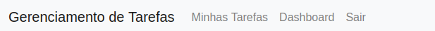
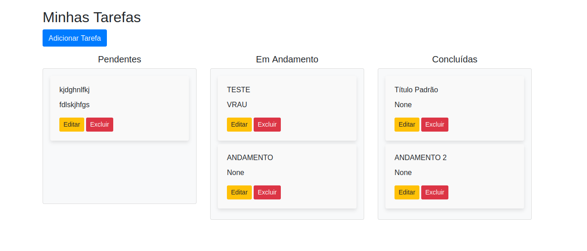
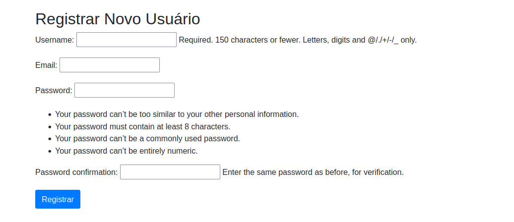
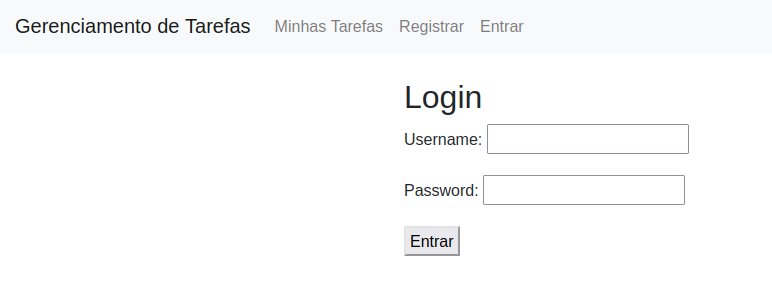
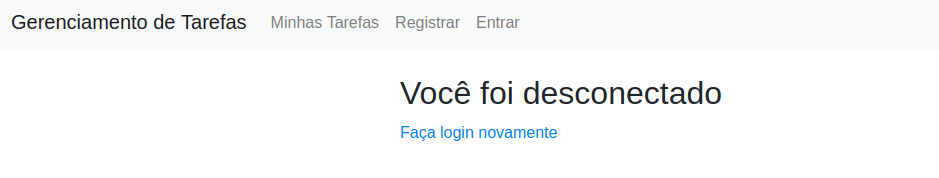
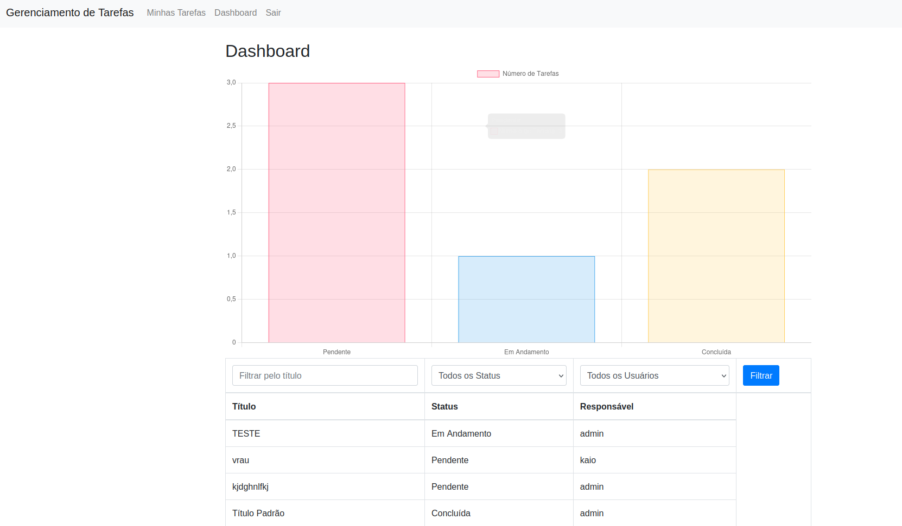

# Sistema de Gerenciamento de Tarefas 

Este documento fornece as etapas necessárias para configurar e executar o sistema Django localmente incluindo a criação de um superuser para acesso total.

## Pré-requisitos

Antes de iniciar, certifique-se de ter os seguintes softwares instalados:

- Python 3.12.3 ou superior
- Django
- Pip (gerenciador de pacotes do Python)
- Virtualenv (opcional, mas recomendado)
- MySQL pois é o banco de dados usado para esse projeto


### 0. Crie seu ambiente virtual(se optar por um)

Para o desenvolvimento deste projeto usamos ambientes virtuais, portanto é recomendado que você também use. 

### 1. Clonar o Repositório

Primeiro, clone este repositório na sua máquina local:

```bash
git clone https://github.com/Jonas1541/Trabalho_WebPython_-A2-.git
cd Trabalho_WebPython_-A2-
```
### 2. Configuração do ambiente e banco de dados

No seu ambiente, é necessário instalar o django para rodar o projeto:

```bash
pip install django
```

Após isso também é necessário instalar as biblioteca de mysql necessárias:

```bash
pip install mysqlclient
pip install pymysql
```

No arquivo setting.py localizado em Trabalho_WebPython_-A2-/gerenciador_tarefas/settings.py é preciso ajustar as configurações de acesso ao seu banco de dados local

```bash
DATABASES = {
    'default': {
        'ENGINE': 'django.db.backends.mysql',
        'NAME': 'gerenciador_tarefas_db',
        'USER': 'root',
        'PASSWORD': 'SUA ROOT', <<<< COLOCAR SUA SENHA DE ACESSO AO ROOT
        'HOST': 'localhost',
        'PORT': '3306',
    }
}
```

Por fim, para criar as tabelas no banco é necessário mandar as migrations criarem:

```bash
python manage.py makemigrations
```

E depois de fato executar as migrations
```bash
python manage.py migrate
```

**CASO UM ERRO ACONTEÇA AO RODAR ALGUM DESSES DOIS COMANDOS ACIMA, POR FAVOR CRIE MANUALMENTE UM BANCO DE DADOS MYSQL COM O NOME `gerenciador_tarefas_db` NO SEU LOCALHOST**

Ao rodar as migrações com o comando acima, um superser será criado automaticamente com as seguintes credenciais:

- **Usuário**: `admin`
- **Email**: `admin@example.com`
- **Senha**: `admin123`

Você pode alterar essas credenciais no arquivo `create_superuser.py`, se necessário.

### 3. Uso do sistema

Para subir o servidor do sistema, por favor, rode o comando abaixo e realize o login com as credenciais acima:

```bash
python manage.py runserver
```


O sistema possui 2 abas principais, a de **MINHAS TAREFAS** e a de **DASHBOARD**(só visível caso o usuario seja um superuser), além dessas também temos a aba de **REGISTRO**(caso o usuario não esteja logado):



A aba **MINHAS TAREFAS** exibe apenas as tarefas do usuario logado, para ver todas as tarefas é necessário entrar como superuser e acessar a aba **DASHBOARD**:



A aba **REGISTRO** só realiza cadastro de usuarios padrões(não superusers):



A aba de **ENTRAR** só aparece caso o usuario esteja deslogado:



A aba de **SAIR** só aparece caso o usuario esteja logado:



Para melhor visualização da aba **DASHBOARD**, cadastre alguns usuarios e atribua tarefas a eles, assim o gŕafico será populado bem como a tabela:


